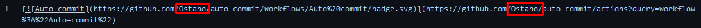
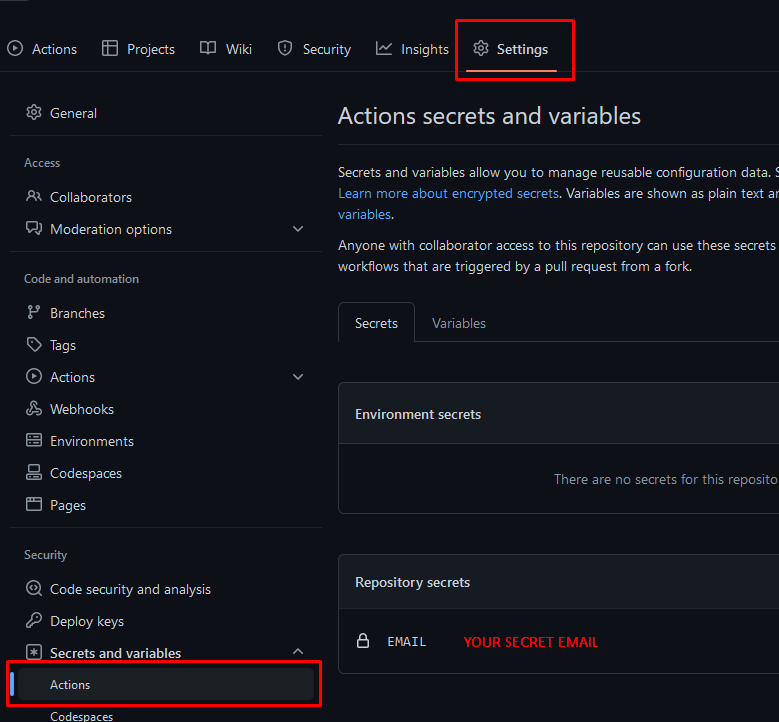
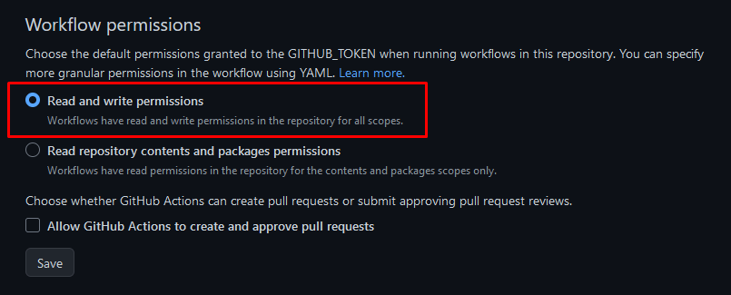

## Auto commit

This is a template for auto committing to GitHub using GitHub Actions.  
Check out the [workflow](.github/workflows/autocommit.yml) for more details.  
To configure cron job, check out [this](https://crontab.guru/) website.  

### Things to do:
1. Use this template
2. Replace usernames  
*autocommit.yml:*  
  
*README.md:*  

3. Add GitHub Actions secret with your email  
  
4. Make sure GitHub Actions is allowed to read AND write to your repository  
*Settings > Actions > General > Workflow permissions*  
  
5. GitHub Action will now run every day at 00:00 UTC and commit the current date to [*CURRENT_DATE*](https://github.com/Ostabo/auto-commit/blob/master/CURRENT_DATE) 

Note that GitHub Actions cron jobs might be delayed at high load times.

Action used: [GitHub Action for GitHub Push](https://github.com/ad-m/github-push-action)